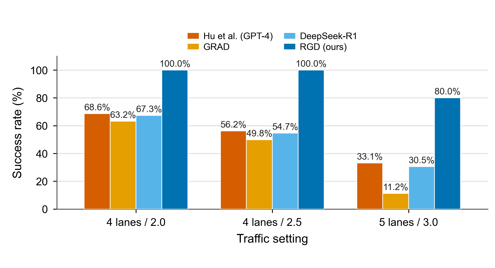
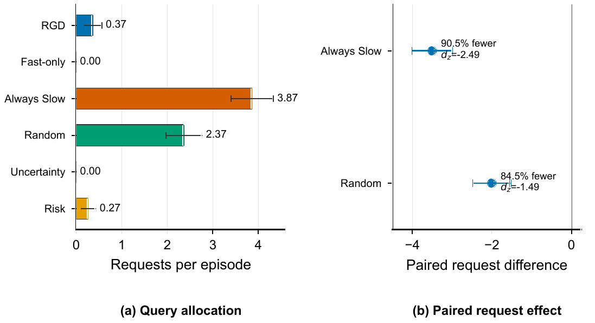
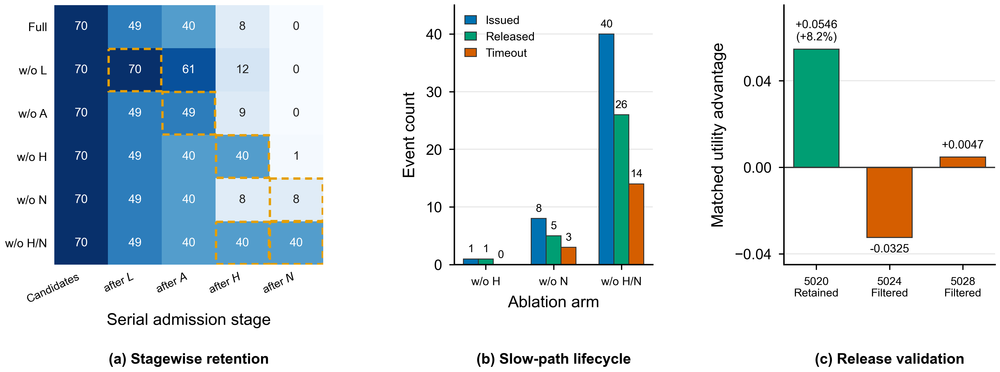

# RGD-Driver：面向闭环自动驾驶大语言模型的释放感知门控审议

> **RGD-Driver: Release-Aware Gated Deliberation for Large Language Models in Closed-Loop Autonomous Driving**
>
> LiYi Xie
>
> 本文档与当前 `main.tex` 正文同步。公式、图、表、数值和正文引用编号与英文稿一致。图内英文标注保留原图。本文档不附参考文献列表。

## 摘要

大型语言模型在自动驾驶的语义场景理解与高层决策中展现出较强能力。然而，其推理时延会引入根本性的释放时刻失配：推理请求从一个交通状态发出，响应只有在场景演化后才可用。现有双过程与异步驾驶系统主要关注何时调用慢推理器，或如何在推理期间维持快速控制，却缺少显式机制来判断延迟提案在演化状态中是否仍然有效、不同于当前快速动作且具有收益。本文提出 RGD-Driver，一种基于释放感知门控审议（Release-Aware Gated Deliberation，RGD）的双阶段框架，用于管理闭环驾驶中的慢推理器准入与释放验证。在查询时刻，RGD 仅在延迟可行性、动作支持、恢复代价优势与场景需求共同满足时发出请求。在释放时刻，系统在观测状态中重新映射返回提案，并仅在其相对于当前快速命令通过可行性、动作差异性与恢复代价检查后予以授权。本文进一步提出审议的可恢复价值（Recoverable Value of Deliberation，R-VoD），一种量化释放状态中可用纠正机会的离线匹配推演诊断量。highway-env 与 MetaDrive 上的闭环实验表明，在匹配种子评估下，RGD 在保持任务结果的同时显著减少慢路径调用。释放验证能够保留纠正性干预，并滤除有害或可忽略的替代方案。

**关键词：** 自动驾驶，闭环决策，推理时延，大型语言模型，可恢复性，选择性计算。

## I. 引言

大型语言模型（LLM）推动了自动驾驶中的语义场景理解、驾驶知识检索与高层决策 [1] 至 [4]。当决策依赖场景关系、驾驶规则或长时域意图时，这些能力可为响应式策略提供审议补充。然而，闭环部署引入了静态决策基准中不存在的时间要求：推理请求从查询状态发出，但在快速控制器与周围交通持续演化后，提案才在后续释放状态中可用。考虑前车正在接近、相邻车道最初开放的情形。查询时合理的变道提案可能在目标间隙缩小、该机动失去优势，或快速控制器已经选择相同动作之后才到达。因此，查询时的语义正确性并不能建立释放时的控制权限。关键问题不只是 LLM 的响应速度，而是其延迟输出在实际影响车辆的状态中是否仍构成有效且有用的干预。

现有系统从不同控制环节处理这一问题。选择性计算方法在推理前判断场景是否需要慢推理。异步架构在慢分支等待期间维持快速控制流。运行时保障方法则检验候选动作是否满足可接受的安全包络。这些功能分别回答是否投入计算、如何在推理期间维持控制，以及动作本身是否安全，却不能判断返回提案是否应替换同期快速命令。该判断要求在观测到的释放状态中重新映射响应，并通过相同的动作与代价接口和快速分支比较。仅有可行性并不充分，因为安全提案可能冗余或不具备纠正优势。查询准入也不能为尚未生成的动作授予持续权限。因此，延迟审议需要两个独立的权限决策：计算前的查询准入与执行前的释放验证。

本文提出 RGD-Driver，将慢推理器视为受释放条件约束的提案生成器，而非持续命令来源。释放感知门控审议（RGD）仅在延迟可行性、替代动作支持、恢复代价优势与场景需求同时成立时准入请求。响应到达后，RGD 在当前状态中重新映射提案，并仅在其仍然可行、不同于当前快速命令且具备充分恢复代价优势时授权。被拒绝、格式错误或过期的提案不会改变快速控制流。本文进一步定义审议的可恢复价值（R-VoD），以共同延续策略下的离线匹配推演度量释放状态中可用的纠正机会。R-VoD 不进入在线门控，而是用于检验 RGD 所选状态是否保留有意义的干预价值。配对闭环实验、受控时延分析、组件消融与匹配提案重放将资源分配结果与产生该结果的准入和释放机制联系起来。

本文的主要贡献如下：

1. 本文提出 RGD，一种将合取式查询准入与当前状态释放验证相结合的双阶段权限框架。共享动作映射器、恢复代价评估器与快速路径回退构成释放契约，使延迟提案仅在可行、具有差异且具备优势时影响执行。
2. 本文提出 R-VoD，一种离线匹配推演度量，通过在共同延续策略下改变首个有效动作，量化释放状态中的纠正机会。该度量将释放状态价值与推理器输出质量分离，并提供独立的机制诊断。
3. highway-env 与 MetaDrive 上的闭环实验结果表明，RGD 在保持配对任务结果的同时将持续慢路径使用减少 90% 以上。释放验证保留该纠正性干预，并过滤有害或可忽略的替代方案。

## II. 相关工作

### A. 语言条件与生成式驾驶

语言条件驾驶方法在决策角色及输出与车辆执行的接近程度上存在差异。在建议层面，DiLu 在生成可解释决策前检索相关经验 [1]。Driving with LLMs 以对象级向量表示交通，并返回动作及解释 [2]。GPT-Driver 将规划表述为语言建模 [3]。驾驶知识增强方法则在决策前提供领域特定背景 [4]。这些研究表明，语言模型能够编码场景关系、检索驾驶知识，并通过结构化或可解释接口表达高层意图。

另一类方法将模型输出置于更接近规划与控制边界的位置。C-TRAIL 将常识推理引入轨迹规划 [5]。策略迁移方法使用语言模型解析任务描述并选择可复用驾驶策略 [6]。生成式驾驶方法学习预测性场景表示或未来轨迹，以服务下游规划 [7] 至 [10]。这些方法提高了模型输出的运行相关性，也使时间对齐更为重要：提案越接近执行，能够修正早期状态所生成动作的下游环节越少。上述研究主要关注如何生成有效的驾驶提案或表示。RGD 处理与之互补的系统问题，即延迟提案如何获得执行权限。它不替代底层推理器、规划器或学习表示，而是提供统一的释放接口，在当前状态中重新解释返回输出，并与快速控制器已经提供的动作进行比较。

### B. 双过程推理与选择性计算

双过程驾驶系统结合快速策略的响应频率与审议模型的上下文推理能力。FASIONAD 通过自适应反馈协调两个分支 [11]，AdaDrive 根据场景需求调整审议深度 [12]，NetRoller 通过异步执行连接通用模型与专用模型 [13]，LeapAD 则在双过程架构中引入反思与累积经验 [14]。这些方法主要决定审议分支何时或如何参与，同时保持响应式策略可用。

选择性计算与元推理密切相关，后者在预期决策改进与计算代价之间进行权衡。限时与 anytime 方法在有限预算下调度推理 [15] 至 [18]，并发规划允许执行器在规划器计算期间继续动作 [19]。这些原理为查询准入提供依据，但查询时价值只是对未来机会的估计。在闭环驾驶中，推理期间交通继续演化，快速控制器也持续动作。支撑请求的替代方案可能在响应到达前消失、变得冗余或被取代。RGD 将选择性计算从调用扩展到权限管理。准入门控控制是否值得启动慢推理，释放门控控制是否值得应用其实际输出。R-VoD 则度量释放状态中剩余的纠正机会，而非查询状态下推断的预期价值。这种分离避免将成功发出的请求视为无条件的未来命令。

### C. 运行时安全、时延与可行性

时序与保障机制提供了可部署系统所需的另外两个组成部分。AsyncDriver 将语言模型规划与实时控制分离 [20]，基于 Simplex 的架构在学习动作未通过接受测试时保留可信控制器 [21]，事件触发控制确定何时需要稳定控制更新 [22]，边缘计算框架在异构资源上调度卸载计算 [23]，时延感知控制则显式建模输入滞后期间的状态演化 [24]。这些方法共同处理控制连续性、计算时序与延迟系统动力学。

形式化安全方法定义动作是否处于可接受集合内。RSS 规定责任敏感的安全距离 [25]，可行性理论为连续动力学构造不变运动集合 [26]。此类证书能够回答候选动作是否可安全执行，但释放决策还需要进行比较。延迟提案可能满足安全约束，却与快速动作重复或不具备恢复收益。因此，RGD 在最终安全投影前运行：它在观测到的释放状态中重新映射两个分支，检验可行性、差异性与恢复代价优势，并在慢提案未通过比较时保留快速命令。无论选择哪个分支，下游安全投影始终有效。总体而言，已有研究分别深入讨论了模型能力、查询时资源分配、异步执行与运行时安全，但响应到达与车辆执行之间的接口仍未得到明确处理。RGD 使该接口显式且可检验，R-VoD 则提供与在线系统实际经历的释放状态相对应的离线度量。

## III. 释放感知门控审议

RGD 将慢推理器调用分解为两个连续的权限决策：查询准入与释放验证。准入阶段判断当前场景是否需要审议，以及预期响应时段内能否支持可行替代动作。释放验证在响应交付时的观测状态中评估返回提案。快速控制器在整个推理期间始终为默认路径，并在任一阶段不授予慢路径权限时继续控制。若释放状态 $s_r$ 存在至少一个可行有效替代动作，且其相对快速有效动作的匹配推演优势达到 R-VoD 裕度，则 $s_r$ 为**可恢复状态**。R-VoD 通过匹配推演在离线阶段量化该纠正机会。只有当返回提案的映射命令通过当前状态可行性检查、不同于映射后的快速命令，并满足提案特定的恢复代价裕度时，该提案才在释放时具有**可执行性**。最终安全投影仍可能将已授权的慢命令折叠为与快速命令相同的可执行动作。因此，R-VoD 与释放验证相互补充但不可互换。

*图 1. RGD 系统架构。实线箭头表示在线控制路径，虚线表示离线 R-VoD 诊断分支。memory 模块属于慢推理器输入上下文，而非在线门控。*

图 1 展示两个在线门控与离线 R-VoD 诊断分支。每个控制周期中，观测状态同时输入始终活动的快速控制器与查询准入门控。后者联合检查时延可行性 $L_t$、动作支持 $A_t$、代价优势 $H_t$、场景需求 $N_t$ 及可用资源，以决定是否查询慢推理器。驾驶记忆向慢推理器提供近期状态与检索经验，作为额外推理上下文。快速与慢速输出先由共享动作映射器规范化，随后释放验证依次检查当前状态映射、状态可行性、与快速动作的差异性及代价优势。统一安全屏障再将经验证动作投影为车辆执行，并把下一状态反馈回闭环。下方分支保存释放状态快照，对快速与候选动作进行 rollout 对比，并离线生成 R-VoD 标签用于诊断，而不参与在线控制。
### A. 查询与释放过程
在帧 $t$，本车观测状态 $s_t$。快速策略产生动作，并由共享映射器转换为 $a_t^f$。两个分支共享该映射器与最终安全投影 $\Phi(s,a)$，后者在状态 $s$ 中将命令映射为可执行动作。每个映射命令 $a\in\mathcal A(s)$ 均包含机动原语与目标速度。若两个表达产生相同的二元组，则视为等价。机动分量包括向左变道、保持车道、向右变道、加速与减速，所有机动均通过同一仿真器接口解析。响应解析器 $\psi(y)$ 对结构化标识符或标准词元进行规范化，$\mathcal M(s,y)$ 则在 $\mathcal A(s)$ 中构造相应命令。当机动或目标速度在状态 $s$ 中无效时，该映射未定义。这一过程属于当前状态语义映射，而非轨迹重规划。返回提案在观测到的释放状态 $s_r$ 中重新映射。查询时可行的变道或速度命令在释放时可能已不再有效。任何映射或可行性失败都会使系统保留 $a_r^f$。时延估计仅用于准入。实际释放帧 $r$ 是响应首次可用的控制帧，返回命令与快速命令均在观测状态 $s_r$ 中评估。回合终止前未到达的响应将被丢弃。

### B. 查询准入

令 $\mathcal A(s_t)$ 表示精确的运行时动作域，$a_t^f$ 表示映射后的快速命令。运行时恢复代价评估器为

$$
c_t(a)=\operatorname{clip}_{[0,1]}\!\left(
h_t+\left[d_t(a)-\min_{b\in\mathcal A(s_t)}d_t(b)\right]_+\right),
\tag{1}
$$

其中 $[x]_+=\max(x,0)$。$d_t(a)\in[0,1]$ 是由安全、舒适性与效率代价组成的固定权重惩罚，$h_t\in[0,1]$ 是聚合 TTC 紧迫度、时距不足、障碍物邻近度与交互压力的场景级风险。$c_t$ 越低越优。代价输入格式错误或动作域不一致时，系统抑制准入。域完整性保护项 $F_t$ 要求动作域一致，且存在非空的可行替代动作集合
$\mathcal D_t=\{a\in\mathcal A(s_t)\setminus\{a_t^f\}:c_t(a)\leq\kappa_c\}$，其中 $\kappa_c\in(0,1]$ 为恢复代价可行性阈值。若 $\mathcal D_t=\varnothing$，则 $F_t=0$，系统不发出慢请求。

延迟可行性由控制频率 $f>0$、预测时延 $\widehat\tau_t$、临界机动窗口 $T_t^{\mathrm{crit}}$ 与安全预留量 $\rho$ 表征，其中 $T_t^{\mathrm{crit}}>0$，并根据当前 TTC 与可行轨迹走廊估计。残余窗口分数为

$$
\ell_t=\operatorname{clip}_{[0,1]}\!\left(
\frac{T_t^{\mathrm{crit}}-\lceil f\widehat\tau_t\rceil/f-\rho}
{T_t^{\mathrm{crit}}}\right).
\tag{2}
$$

时序证据不可用时令 $L_t=0$。令 $\mathcal F$ 为固定的非 Fast 机动族集合，$\mathcal F_t\subseteq\mathcal F$ 为 $\mathcal D_t$ 中包含的机动族，$u_m$ 为 $\mathcal D_t$ 中族 $m$ 的最小恢复代价，$u_*=\min_{m\in\mathcal F_t}u_m$。按 $|\mathcal F|$ 归一化后，动作族覆盖率表示全部机动族的绝对比例，缺失机动族会降低该分数。若 $\mathcal F_t=\varnothing$，则 $A_t=0$。四项准入检验为

$$
\begin{aligned}
L_t&=\mathbb{I}[\ell_t\geq\lambda_L],
&&\text{(3a)}\\
A_t&=\mathbb{I}\!\left[|\mathcal F|^{-1}\!\sum_{m\in\mathcal F_t}
e^{-(u_m-u_*)/T_A}\geq\lambda_A\right],
&&\text{(3b)}\\
H_t&=\mathbb{I}\!\left[\kappa_c^{-1}
[c_t(a_t^f)-\min_{a\in\mathcal D_t}c_t(a)]_+\geq\lambda_H\right],
&&\text{(3c)}\\
N_t&=\mathbb{I}[\max(h_t,n_t^{\mathrm{pre}})\geq\lambda_N],
&&\text{(3d)}
\end{aligned}
$$

其中 $n_t^{\mathrm{pre}}\in[0,1]$ 是由障碍物密度与冲突几何得到的独立场景风险预筛分数，$T_A>0$ 为动作族支持的软聚合温度。阈值 $(\lambda_L,\lambda_A,\lambda_H,\lambda_N)$ 在校准队列上确定，并在报告的评估前冻结。$N_t$ 用于识别审议需求，$F_t$ 则拒绝不存在可行恢复替代动作的状态。四项准入检验必须同时成立。

令 $v_t\in\{0,1\}$ 表示资源可用性，包括请求预算、冷却时间与执行器状态，并要求当前不存在待处理的慢请求。准入规则为

$$
q_t=\mathbb I[v_t\wedge F_t\wedge L_t\wedge A_t\wedge H_t\wedge N_t],
\tag{4}
$$

其中 $\mathbb I[\cdot]$ 为示性函数。

### C. 释放验证

在释放帧 $r$，令 $y_r$ 表示返回响应，$\mathcal M$ 表示共享的当前状态映射器。快速策略从同一状态 $s_r$ 独立产生 $a_r^f$。若 $\mathcal M(s_r,y_r)$ 未定义，则拒绝响应并保留 $a_r^f$。否则令 $\widetilde a_r^{\mathrm{sl}}=\mathcal M(s_r,y_r)$ 表示映射后的慢命令。由 $F_r$、$A_r$ 与 $H_r$ 表示的动作域、绝对可行性、机动支持与代价余量检验，以及代价函数 $c_r$，均根据 $s_r$ 与同期 $a_r^f$ 重新计算。延迟可行性与场景需求仅用于准入，不再进入释放阶段。若 $F_r\wedge A_r\wedge H_r$ 成立，则可行慢命令集合为 $\mathcal V_r=\{a\in\mathcal A(s_r):c_r(a)\leq\kappa_c\}$，否则 $\mathcal V_r=\varnothing$。释放示性量为

$$
g_r=\mathbb I\!\left[
\widetilde a_r^{\mathrm{sl}}\in\mathcal V_r
\wedge\widetilde a_r^{\mathrm{sl}}\neq a_r^f
\wedge c_r(\widetilde a_r^{\mathrm{sl}})+\delta\leq c_r(a_r^f)
\right],
\tag{5}
$$

其中 $\delta\geq0$ 为与 $c_r$ 同尺度的释放裕度，固定取 $\delta=0.02$。

选择命令与执行命令分别为

$$
a_r^{\mathrm{sel}}=
\begin{cases}
\widetilde a_r^{\mathrm{sl}}, & g_r=1,\\
a_r^f, & g_r=0,
\end{cases}
\qquad
a_r^{\mathrm{exec}}=\Phi(s_r,a_r^{\mathrm{sel}}).
\tag{6}
$$

式（6）显式给出快速路径回退：当 $g_r=0$ 时，$a_r^{\mathrm{exec}}=\Phi(s_r,a_r^f)$。差异性在最终投影 $\Phi$ 之前的映射命令之间评估，因此已授权慢命令仍可能在投影后转换为与快速命令相同的可执行动作。本文单独报告该投影后结果。查询准入不会向返回提案授予持续权限，R-VoD 标签也不进入在线释放决策。所有检查均在观测状态 $s_r$ 上执行，并且只授权相对同期快速动作具有严格恢复代价优势的提案。

### D. 纠正机会的离线度量

离线匹配推演提供状态级诊断，用于度量释放时可用的纠正机会，且不依赖特定慢推理器响应。在每个记录的释放快照 $s$ 上，令 $a_{\mathrm{eff}}^f=\Phi(s,a^f)$ 表示经过共同最终安全投影后的快速有效首动作。令 $\mathcal D(s)$ 为经过相同投影后仍然可行、且与 $a_{\mathrm{eff}}^f$ 不同的有效首动作集合，并令 $\mathcal C(s)=\{a_{\mathrm{eff}}^f\}\cup\mathcal D(s)$。时域 $H\in\mathbb N_+$、折扣 $\gamma\in[0,1]$ 下的匹配推演效用定义为

$$
J_H(s,a)=\frac{\sum_{k=0}^{H-1}\gamma^k r_k}
{\sum_{k=0}^{H-1}\gamma^k}
-\mathbb I[E_C],
\tag{7}
$$

其中 $s_0=s$、$a_0=a$，$k\geq1$ 时由快速策略提供 $a_k$，$r_k$ 为归一化的逐步仿真器奖励，$E_C$ 表示推演时域内发生碰撞。碰撞会终止推演并产生单位惩罚。终止后的奖励增量取零，分母仍为固定的 $H$ 步折扣和。本文取 $H=20$、$\gamma=0.99$。经过共享投影后具有相同命令与目标速度的候选在评估前合并。审议的可恢复价值定义为

$$
\mathrm{R\text{-}VoD}(s)=
\max_{a\in\mathcal C(s)}
\left[J_H(s,a)-J_H(s,a_{\mathrm{eff}}^f)\right].
\tag{8}
$$

由于 $a_{\mathrm{eff}}^f\in\mathcal C(s)$，R-VoD 按构造非负。当不存在优于快速延续的替代动作时，其值为零。当 $\mathrm{R\text{-}VoD}(s)\geq\epsilon_{\mathrm R}$ 时，该状态被标记为**纠正状态**，其中 $\epsilon_{\mathrm R}=0.02$ 是固定的效用尺度裕度。尽管 $\epsilon_{\mathrm R}$ 与在线代价尺度裕度 $\delta$ 的数值相同，二者相互独立。R-VoD 不进入在线门控。通过仅改变第一个有效动作，并令后续轨迹由共同快速策略产生，R-VoD 将释放时的纠正机会与慢推理器响应的下游变化分离。该构造直接对应第 IV 节中的纠正状态消融与匹配提案释放分析。

## IV. 实验与讨论

### A. 实验设置

本文在 highway-env [28] 与 MetaDrive [29] 闭环仿真器上评估 RGD，默认慢推理器为 Qwen3-8B [30]。主要 highway-env 实验以 10 Hz 运行，每回合持续 30 s。各比较方法共享种子队列、控制接口、推理器服务、请求预算与评估规则。配对资源分配研究使用 30 个种子，机制分析使用独立的 20 个种子队列。

仿真器种子定义配对实验单元。本文报告 95% bootstrap 区间，并采用精确 McNemar 检验或配对符号翻转检验，对预先设定的对比进行 Holm 校正。门控判据、纠正裕度与服务设置在评估前完成校准并冻结。R-VoD 通过匹配首动作推演在离线阶段计算。配对队列提供主要的资源与任务比较，受控时延和匹配提案队列用于隔离释放行为。图 2 展示 highway-env 与 MetaDrive 中覆盖车道跟随、汇入、环岛和交叉口的代表性场景，并在相同查询与释放接口下保持动作契约不变。

*图 2. highway-env 与 MetaDrive 的代表性场景。*

### B. 已发表设置下的性能背景

在 PADriver [31] 的环境设置下，表 I 将 RGD 置于已报告方法的运行范围内。RGD 在 30 次运行中完成 29 次，行驶距离为 611 m、速度为 73.60 km/h，且无需针对评估环境进行专门训练。在本文评估平台上，RGD 的单帧运行时间为 37.6 ms。依照来源论文定义，Saf. 表示安全距离保持率，Kep. 表示车道保持率。二者均在 $[0,1]$ 内报告，数值越大表示相应事件发生频率越高。RGD 在该比较中获得最佳距离、速度与完成次数。相较 PADriver--Normal，其距离增加 8 m，速度提高 1.13 km/h，成功运行增加 4 次。PADriver 在其专用个性化策略目标下获得最高的 Saf. 与 Kep.。

本文参考 Hu 等人 [27] 的 highway-env 实验设置，采用相同的动作空间、连续 30 帧无碰撞成功判据以及 4L/2.0、4L/2.5 和 5L/3.0 交通配置，在不增加人为响应时延的条件下评估 RGD。图 3 对比 RGD 与 ChatGPT-4、GRAD 和 DeepSeek-R1-7B 在上述设置下的成功率。表 II 给出相应运行指标。

*图 3. Hu 等人交通设置下的 highway-env 成功率。*

RGD 在三个设置中的成功率分别达到 100.0%、100.0% 与 80.0%，较每个设置中的最强已发表结果分别提高 31.4、43.8 与 46.9 个百分点。表 II 表明，该增益仅对应每回合 1.0、1.0 与 0.8 次慢路径请求，且三种设置下的单帧运行时间均低于 66 ms。最大优势出现在 5L/3.0。在该设置中，车道数与交通密度同时增加，使查询状态中的动作更容易在释放前失去支持。RGD 在两个边界处理这一问题：合取式准入将慢推理保留给具有动作支持的替代方案，当前状态验证则在间隙闭合或优势消失后拒绝返回机动，快速路径覆盖这些稀疏请求之间的控制周期。这种释放感知分工说明了在已发表基线随交通复杂度下降时，RGD 仍能维持较大成功率优势的原因。表 II 报告安全条件限定的速度，对失败的 RGD 运行赋值为零，并给出各设置下的请求率。

*图 4. 30 个种子配对协议下的慢路径资源分配。（a）每回合平均请求数及 95% 种子 bootstrap 区间。（b）RGD 相对两个请求密集型分配器的配对差，负值表示 RGD 请求更少。*

### C. 查询侧与释放侧机制证据

#### 1. 查询侧资源分配与时延敏感性

配对资源分配研究在共同的 30 个种子协议下比较 RGD 与五种调度基线：Fast-only（从不调用慢推理器）、Always Slow（在每个可用帧发出请求）、Random（在每个可用帧以均匀概率请求）、Uncertainty（快速策略熵超过阈值时请求）与 Risk（独立 TTC 紧迫度分数超过阈值时请求）。所有方法共享 Qwen3-8B 服务、快速控制器、动作映射器、释放接口与回合实现。唯一差别是慢路径资源分配策略。图 4（a）报告每回合请求数，图 4（b）报告 RGD 相对两个请求密集型分配器的配对效应。

RGD 平均每回合发出 0.37 次请求。相比 Always Slow，慢路径使用量减少 90.5%，相比 Random 减少 84.5%。配对差分别为 $-3.50$ 次请求 [95% CI $-4.00$, $-3.00$] 与 $-2.00$ 次请求 [95% CI $-2.47$, $-1.53$]，配对标准化效应分别为 $d_z=-2.49$ 与 $-1.49$。两项对比经 Holm 校正后仍显著（$p_{\mathrm H}=0.00025$）。这相当于 30 个回合中 RGD 共发出 11 次请求，而 Always Slow 与 Random 分别约为 116 次与 71 次。Fast-only 与 Uncertainty 提供零请求参照，Risk 平均每回合发出 0.27 次请求。RGD 因而形成稀疏但非零的资源分配方式：式（4）的合取条件排除常规、缺乏动作支持或时延不可行的机会，同时在全部准入谓词成立时保留慢推理入口。由于各方法共享推理器服务与释放接口，显著的配对降幅来自准入策略，而非模型或动作空间差异。11 次获准请求对应延迟可行性、替代动作支持、代价优势与场景需求同时成立的少量状态。这种多条件选择性正是持续调用或单触发分配器无法提供的 RGD 价值。

为检验时延约束放宽时同一准入机制的作用，零时延队列在六种资源分配策略之间固定快速控制器、慢推理器、请求预算与可行性接口。只有请求与释放规则不同。随后，时延扫描在相同种子与机会调度上评估延迟可行性对慢路径资源分配的影响。

在无附加时延时，图 5（a）和（b）显示 RGD 发出 161 次请求，较 Always Slow 少 10.6%，并将平均单帧运行时间从 37.4 ms 降至 35.5 ms。由于该设置中的时延约束较为宽松，请求减少主要来自动作支持、恢复代价与场景需求谓词。在图 5（c）的固定门控扫描中，请求数从 0 与 0.7 s 下的 161、162 次，变为 1.7 与 2.7 s 下的 143、109 次。从 0 到 2.7 s，请求量减少 32.3%，同时平均距离保持在约 599 至 605 m，95% 区间相互重叠。0 与 0.7 s 下近似相等的计数表明，短时延尚未明显压缩已准入机动窗口。1.7 与 2.7 s 下的降幅则从预测释放时刻逼近这些窗口时开始出现。因此，$L_t$ 将预测响应时段转化为工作量控制：RGD 不再发起其候选机动难以持续到释放时刻的提案，无需针对各时延重新调参，并保持该扫描中的行驶进度分布。

*图 5. 零附加时延与固定门控时延扫描下的慢路径资源分配。（a）零时延队列中的请求总数。（b）平均单帧运行时间。（c）带 95% 种子 bootstrap 区间的平均距离，标签表示对应的 RGD 请求数。*

**表 I  PADriver 报告的环境设置下的性能背景**

| 方法 | 距离（m） | 速度（km/h） | Saf. | Kep. | 完成（/30） |
|---|---:|---:|---:|---:|---:|
| Driving with LLMs | 411 | 49.42 | 0.49 | 0.56 | 20 |
| GPT-Driver | 428 | 51.40 | 0.45 | 0.52 | 23 |
| DiLu | 386 | 46.29 | 0.60 | 0.72 | 28 |
| PADriver--Normal | 603 | 72.47 | **0.91** | **0.92** | 25 |
| RGD（本文） | **611** | **73.60** | 0.75 | 0.86 | **29** |

**表 II  Hu 等人设置下的 RGD 运行指标**

| 设置 | 距离（m） | 速度（m/s） | 请求/回合 | 时间（ms/frame） |
|---|---:|---:|---:|---:|
| 4L / 2.0 | 69.29 | 23.84 | 1.0 | 58.9 |
| 4L / 2.5 | 66.19 | 22.76 | 1.0 | 65.2 |
| 5L / 3.0 | 52.38 | 17.38 | 0.8 | 50.1 |

#### 2. 延迟响应的释放侧验证

释放侧研究引入固定的 1.7 s 附加时延，考察交通状态演化后 RGD 如何处理慢响应。快速控制器、慢推理器、请求预算、种子队列与可行性接口保持固定。图 6 报告响应验证阶段与相应释放决策。每个返回提案到达的状态均晚于发起请求的状态，RGD 仅在其通过全部释放检查后才予以应用。响应追踪记录每个请求从准入、响应验证、当前状态映射直至执行的过程。逐项移除消融变体使用独立的 20 个种子队列。每个变体只移除一项准入判据，释放过程保持不变。

在 1.7 s 时延下，查询准入发出 143 次请求，其中 138 次在回合终止前形成释放事件。当前状态可行性、动作支持与可接受代价检查保留 28 个响应。命令差异性保留 9 个，固定恢复代价裕度进一步保留 6 个。共享投影 $\Phi$ 将其中 4 个命令映射为与 Fast 相同的可执行动作，最终仅有 2 个动作能够改变执行。图 6（b）从全部 28 个状态有效结果给出相同分解：22 个未达到 0.02 裕度，4 个通过裕度但在投影后与 Fast 匹配，2 个保持不同。$143\!\rightarrow\!138\!\rightarrow\!28\!\rightarrow\!9\!\rightarrow\!6\!\rightarrow\!2$ 是该释放实验的核心结果。有效响应不会仅因到达而获得权限，143 次已发出请求中有 141 次不改变最终快速路径动作。该追踪揭示了释放门控的主要价值：它将大量模型输出压缩为少量执行变化，并在延迟提案过期、冗余或优势不足时维持快速命令。

*图 6. 1.7 s 附加时延下的响应验证。（a）从请求发出到投影后执行的阶段性留存。（b）28 个状态有效结果按恢复代价优势分层，虚线为固定 0.02 裕度，“最终匹配”表示投影后与快速动作相同。*

图 7 在自然请求流下区分三项准入谓词。相对完整 RGD 的 99 次请求，移除 $L$、$A$ 或 $H$ 后，请求数分别增至 117、107 与 120，并额外暴露 38、36 与 100 个释放状态。R-VoD 纠正状态率的变化依次为 $-0.18$、$+0.36$ 与 $+2.54$ 个百分点。$L$ 与 $A$ 的区间跨越零，说明二者主要调节时延可行性与动作支持所产生的工作量。$H$ 的区间完全位于零以上，但这一增幅同时伴随 100 个额外释放状态。因此，$H$ 是该消融中最主要的在线工作量调节器：移除它会准入更宽的状态群体，其中也包含更多由独立离线诊断标记为纠正性的状态。正向差值并不表示 $H$ 提高了所选队列的纠正状态富集度，而是表明移除 $H$ 同时扩大请求量与纠正状态暴露。该结果区分了两项职责：在线恢复代价控制服务负载，R-VoD 则度量释放时仍然存在的纠正机会。完整 RGD 使用前者实现选择性，并使用后者完成独立机制审计。

*图 7. 20 个种子上的准入判据逐项移除消融。（a）请求总数。（b）相对完整 RGD 的额外释放状态数。（c）R-VoD 纠正状态率差值及 95% 种子 bootstrap 区间。*

为补充自然请求流消融，共享提案库分析在不受调度差异影响的条件下分别考察门控与投影因素。六个条件分别为完整 RGD、移除 $L$、移除 $A$、移除 $H$、移除 $N$，以及同时移除 $H$ 与 $N$。所有条件在固定 1.7 s 时延下，针对 20 个留出种子重放相同的门控独立提案源。动作映射器、释放规则、安全投影、预算与冷却时间保持不变，因此每项比较只移除指定的准入谓词。共享提案库由不读取所评估门控的 Qwen3-8B Always Slow 源冻结而成。每条记录绑定源帧、原始动作、响应结果、实测时延与响应哈希。所有条件重放同一提案库，并在每帧重新计算 Fast 动作。门控决策在向各条件暴露提案字段前完成。

图 8（a）追踪 70 个同步候选经过串行准入阶段的过程。完整 RGD 在 $L$ 后保留 49 个候选，在 $A$ 后保留 40 个，在 $H$ 后保留 8 个，在 $N$ 后不再保留候选。按阶段计算，$L$ 移除提案库的 30.0%，$A$ 移除余下候选的 18.4%，$H$ 移除 80.0%，$N$ 移除最后 8 个候选。单独移除 $L$ 或 $A$ 会改变上游轨迹，但由于下游谓词仍然有效，完整门控后仍为零。移除 $H$、移除 $N$ 或同时移除二者后，完整门控分别保留 1、8 与 40 个候选。图 8（b）将该留存转化为服务负载：三个条件分别发出 1、8 与 40 次请求，其中 1、5 与 26 次到达释放，0、3 与 14 次超时。因此，$H/N$ 组合阻止了 40 次请求涌入执行器。移除 $N$ 与同时移除 $H/N$ 还分别产生 4 个与 16 个不同于 Fast 的映射提案，但共享投影将其全部映射为与快速动作等价的可执行动作。由 20 个配对种子块组织的 120 个观测保持相同任务端点。完整门控由此去除了在该冻结提案库中不能产生不同执行动作的工作量。

匹配提案释放分析将 RGD 自然产生的 11 条提案重放到当前释放门控中。释放验证与无验证条件均得到 9 次释放。无验证条件有 3 个返回命令在共同投影后仍与快速命令不同，释放验证仅保留其中 1 个。图 8（c）给出三项干预的匹配效用。被保留干预的效用优势为 $+0.0546$：它将式（7）的效用从 0.667 提升至 0.721，相对增益为 8.2%，并在两个分支均无碰撞的前提下，使 20 步进度增加 23.70 m。两项被滤除动作的效用优势分别为 $-0.0325$ 与 $0.0047$，均低于固定的 0.02 纠正裕度。因此，释放门控选择了唯一具有实质匹配推演价值的干预，并移除一项有害与一项可忽略的替代方案。图 8 的三个面板构成完整机制链：准入控制服务暴露，投影消除可执行冗余，释放验证仅向具有纠正价值的提案授予权限。

*图 8. 六条件门控消融与匹配提案释放审计。（a）串行候选留存，虚线单元表示被移除的谓词。（b）20 个配对种子上的已发出、已释放与超时请求。（c）3 项投影后不同干预的匹配推演效用优势，横轴为种子标识，“保留”与“过滤”表示释放验证结果。*

**表 III  不同慢推理器的结果**

| 推理器 | 有效响应 | 距离（m） | 完成（/30） |
|---|---:|---:|---:|
| Qwen3-8B | **138** | 599.16 | **29** |
| Qwen3.5-4B | **138** | 599.16 | **29** |
| Qwen2.5-7B | 122 | 599.12 | **29** |
| GPT-5.6-sol | 112 | **603.39** | **29** |
| GPT-5.6-terra | 132 | 599.16 | **29** |
| GPT-5.6-luna | 133 | 599.16 | **29** |
| Fable-5 | 137 | 599.16 | **29** |

**表 IV  不同车道数与交通密度设置下的结果**

| 车道数/密度 | 距离（m） | 成功次数（/30） |
|---|---:|---:|
| 4L/2.0 | 599 | 29 |
| 4L/3.0 | 478 | 23 |
| 5L/2.0 | **629** | **30** |
| 5L/3.0 | 429 | 20 |
| 6L/2.0 | 611 | 28 |
| 6L/3.0 | 453 | 20 |

### D. 推理器接口评估

在独立的 30 回合替换队列上，本文使用六种替代模型替换慢推理器，同时保持 RGD 门控、动作模式与回退路径不变。表 III 显示，有效响应数为 112 至 138，相对最小值变化 23%，但全部七个模型均完成 29/30 个回合。平均距离仅跨越 4.27 m，即 599.12 至 603.39 m。两个 Qwen3 变体返回最多有效响应，GPT-5.6-sol 返回最少，却取得最佳平均距离。因此，在 RGD 下，响应数量并不能直接代表闭环行驶进度。

共享映射器首先将不同模型的表达归一到同一动作模式。释放验证随后在观测状态中检查该动作，快速回退吸收缺失、被拒绝或冗余的输出。这些机制限制了响应数量差异向车辆执行的传递，从而解释表 III 中较窄的距离范围与共同的 29/30 完成结果。该结果体现了推理与权限分离的价值：模型替换会改变响应数量，但共享映射器、释放检查与快速回退限制了这种变化对闭环行为的影响。因此，在所评估的推理器集合中，RGD 不依赖单一慢模型。

### E. 不同车道数与交通密度条件下的评估

表 IV 报告六种车道数/密度配置下的平均距离与成功次数，且未重新调整门控。在低密度（2.0）下，成功次数达到 28 至 30，平均距离为 599 至 629 m。在高密度（3.0）下，成功次数为 20 至 23，平均距离为 429 至 478 m。密集交通会缩小可行间隙并提高交互代价。RGD 在全部六种设置中使用相同的准入与释放参数。

5L/2.0 取得全表最佳的 629 m 与 30 次成功。与 4L/2.0 相比，该设置提供更多横向替代动作，同时保留高密度交通所压缩的释放时机动间隙，因而同时有利于动作支持谓词 $A_t$ 与正恢复代价裕度。在密度 3.0 下，相同谓词会随着间隙收缩而限制慢路径权限，快速路径继续控制车辆，而非强制执行延迟机动。因此，表 IV 展示了固定门控在不同机动空间与交互压力下的预期行为，其中适中的车道数与密度形成最有利的运行条件。

### F. 跨场景评估

**表 V  MetaDrive 复合危险场景评估：A 为行人横穿，B 为无控制交叉口，C 为综合交通**

| 方法 | 场景 | 安全率（%） | 速度（m/s） |
|---|:---:|---:|---:|
| ASR-RL [6] | A | 99.2 | **7.1** |
| ASR-RL [6] | B | **98.3** | **8.6** |
| ASR-RL [6] | C | **97.9** | 6.8 |
| RGD（本文） | A | **100.0** | 4.8 |
| RGD（本文） | B | 94.8 | 7.0 |
| RGD（本文） | C | 84.6 | **6.9** |

依据 Wang 等人 [6] 的场景与指标定义，表 V 比较行人横穿场景 A、无控制交叉口场景 B 和综合危险场景 C 中的无碰撞安全率与平均速度。RGD 在场景 A 中以 100% 取得最高安全率，在场景 B 中保持 94.8% 的安全率与 7.0 m/s 的平均速度，并在场景 C 中以 6.9 m/s 取得最高平均速度。这些运行点表明，统一门控配置能够在安全性与通行效率之间取得较好的均衡，而非针对单一指标进行优化。

这一均衡表现来自 RGD 门控机制的互补作用。当前状态重映射可抑制因行人运动而失效的延迟命令，从而在场景 A 中优先保障无碰撞运行。在场景 C 的综合危险下，合取式准入保留存在动作支持的恢复机动，释放比较移除过期或冗余提案，快速路径维持行驶进度。场景 B 表明，相同机制能够共同维持安全性与速度。RGD 无需场景特定训练或重新调参，即可根据危险构成调整运行均衡。

### G. 讨论

RGD 将慢推理视为受释放条件约束的提案，而非持续命令来源，从而处理查询状态与释放状态之间的时间失配。查询门控将审议集中于具有纠正机会的状态，释放验证则在当前状态中重新映射返回结果，仅接受可行、不同且具有优势的提案。快速回退在响应过期或冗余时保持连续控制，共享动作接口与 R-VoD 诊断则使不同推理器和交通条件下的权限契约与纠正机会评估保持一致。

*局限性与未来工作。* 当前评估采用离散命令、结构化输出与受控仿真时延。未来工作将把该契约扩展到连续轨迹、随机时延、硬件在环和实车环境，并研究交通分布变化下的自适应裕度。快速路径回退与当前状态验证仍是核心保障。

## V. 结论

本文提出 RGD-Driver，一种基于释放感知门控审议的双阶段框架，用于管理何时调用慢推理，以及延迟 LLM 提案能否进入闭环控制路径。通过将查询准入与释放验证形式化为独立的权限决策，RGD 确保延迟提案仅在演化交通状态中可行、不同于当前快速动作且具有恢复代价优势时到达执行路径。配套的 R-VoD 诊断量在离线阶段度量释放状态中可用的纠正机会。

全面的闭环实验表明，RGD 在保持任务结果的同时显著减少慢路径调用。释放验证能够在所评估的提案流中保留纠正性干预，并滤除有害或可忽略的替代方案。共同动作接口在所考察的慢推理器、交通设置与额外场景族上得到一致评估。通过将慢推理重新定位为会过期的提案，而非持续命令来源，RGD 在审议推理与实时控制之间建立了有原则的释放感知决策接口。
