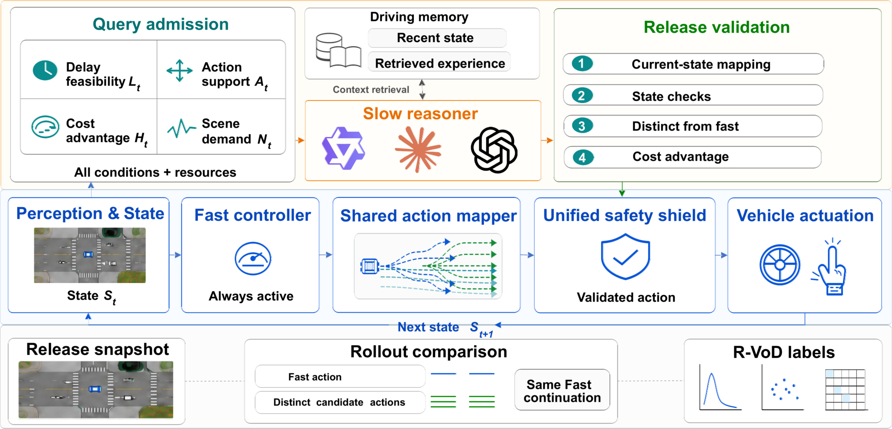
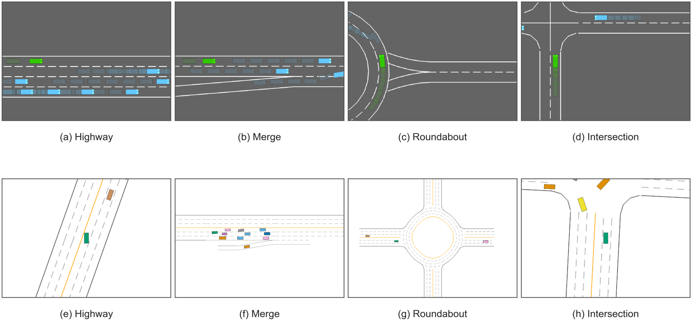
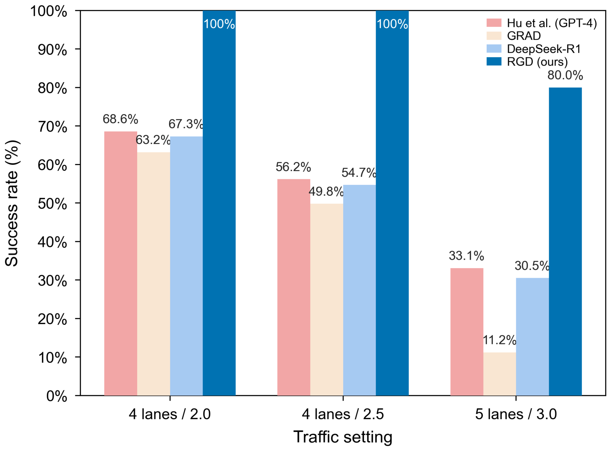
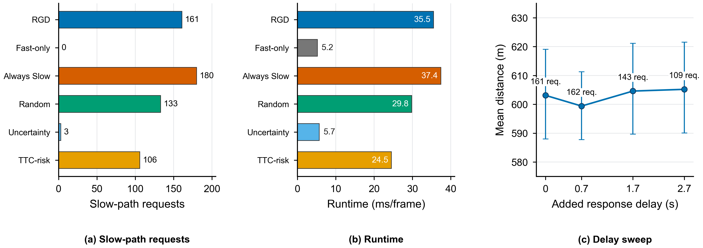
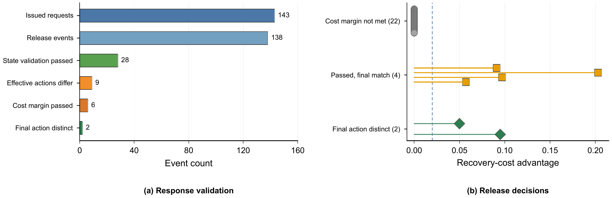
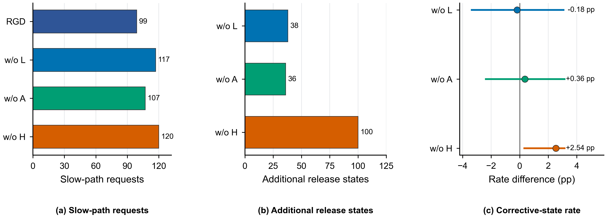

# 面向闭环驾驶释放感知慢推理的可恢复性门控审议

> **Recoverability-Gated Deliberation for Release-Aware Slow Reasoning in Closed-Loop Driving**
>
> 匿名作者
>
> 本文档按照 `main.tex` 的正文顺序完整翻译。公式、图、表、数值和参考文献编号与英文稿一致；图内英文标注保留原图。

## 摘要

大型语言模型能够为自动驾驶提供审议式推理，但推理时延使查询状态与响应可用时的状态相分离。尽管异步系统在推理期间维持快速控制，延迟提案仍必须相对于当前交通状态和控制命令进行评估。本文提出可恢复性门控审议（Recoverability-Gated Deliberation，RGD），一种用于选择性准入慢推理器并进行释放验证的双阶段框架。在查询时刻，只有当延迟可行性、动作支持、恢复代价优势和场景需求共同表明存在有用的审议机会时，RGD 才准入请求。在释放时刻，系统在观测到的当前状态中重新映射返回提案，并仅在其通过当前状态、动作差异性和恢复代价检查后予以授权。本文进一步提出审议的可恢复价值（Recoverable Value of Deliberation，R-VoD），这是一种离线匹配推演诊断量，用于衡量释放时仍保留的纠正机会。闭环实验评估了配对分配策略、受控时延、响应追踪、组件效应、匹配释放状态干预、推理器替换和仿真器适配器。结果表明，相比持续调用和随机调用，RGD 显著减少了慢路径请求，同时保持配对任务结果；在固定的自然查询流上，释放验证保留纠正性干预，并滤除有害或可忽略的延迟提案。

**关键词：** 自动驾驶，闭环决策，推理时延，大型语言模型，可恢复性，选择性计算。

## I. 引言

大型语言模型（LLM）和视觉语言模型（VLM）已被用于自动驾驶系统中的语义场景理解、驾驶知识检索和高层决策 [1]--[8]。这些模型能够提供响应式策略之外的语义背景与长时域意图。然而，闭环部署会引入释放时刻失配：推理请求从一个交通观测发出，而提案在后续状态中才可用。高频控制器可以在审议模型异步运行时维持车辆控制，但系统仍需判断延迟提案是否应影响当前命令。

考虑前车正在接近而相邻车道最初畅通的情形。系统可能向慢推理器请求变道建议。在推理期间，交通状态持续演化，快速控制器继续执行动作。当响应到达时，目标间隙可能已经缩小，原始机动可能不再允许，或者快速控制器可能已经选择相同或代价更低的动作。释放决策必须根据观测到的当前状态和同期快速动作检验该提案。

维持快速控制流并不能解决释放决策问题。返回动作可能通过孤立的状态检查，但在交通演化后与快速动作相同，或者不再具有恢复代价优势。完成这种比较需要统一的动作模式、映射器和状态相关评估器。因此，RGD 将查询准入与释放验证分离。

近期研究分别处理了这一过程的部分环节。调用策略根据不确定性、场景条件或策略差异决定何时启用慢分支 [9]--[11]。基于 VLM 的注意力分配在行为不确定性下对周围车辆确定优先级 [12]。AsyncDriver 和 NetRoller 在模型推理期间维持快速控制 [13], [8]，DualDrive 则将语义意图与实时策略对齐 [14]。运行时保障方法判断候选动作是否可以进入执行路径 [15]。这些研究处理调用时机、控制连续性或候选安全性，但没有通过共享动作接口，在释放时刻明确比较延迟提案与同期快速动作。

本文研究演化后的交通状态是否仍允许纠正动作，以及返回提案在释放时是否提供了该动作。系统设计遵循两个约束：快速控制器必须在整个推理期间保持活动，被拒绝的提案不得干扰控制回路。两个分支的输出均通过共享动作映射器和可行性接口，在同一释放状态下进行评估。

RGD 将慢推理器视为提案生成器，而非快速控制器的替代者。快速动作始终为默认动作，慢提案只有通过共享映射器和安全接口后才能进入执行。该分离允许在不改变释放验证的情况下替换后端，并明确每个执行动作的来源。

若某个释放状态仍存在至少一个可行且有效的替代动作，该动作与快速有效动作保持不同，并超过匹配推演效用裕度，则该释放状态被称为**可恢复**。在查询时刻，RGD 在发出慢请求之前应用在线延迟、支持、代价和需求条件。**可执行性**在释放时评估：返回的映射命令必须通过释放状态检查，与映射后的快速命令不同，并满足恢复代价裕度。可恢复性描述释放状态，可执行性描述最终安全投影之前的返回提案。

审议的可恢复价值（R-VoD）在离线阶段量化可恢复性。它从同一记录释放状态出发，通过匹配推演比较替代首动作与快速首动作，并采用共同的延续策略。R-VoD 衡量释放时仍存在的纠正机会，而不是返回慢提案本身的效用。R-VoD 是由奖励定义的诊断量，不是在线价值估计，也不参与查询准入或释放验证。

在资源可用的前提下，在线门控要求场景需求、延迟可行性、动作支持和代价优势同时成立。高紧迫度不能补偿已经过期的机动窗口，也不能补偿缺少受支持替代动作的情况。快速控制器在推理期间的每个控制周期提供默认命令。响应到达后，释放验证在当前交通状态中评估提案；只有提案通过当前状态映射、状态检查、与快速命令的差异性检查和恢复代价检查，系统才接受该提案。

本文在共享快速控制器、慢推理器、请求预算和动作接口下评估 RGD。配对共同协议研究测量六种策略的资源分配和任务结果，并报告效应量、置信区间及经过多重性校正的检验。受控时延追踪将每次请求连接到释放验证和最终投影。在 30 个配对种子上，固定由 RGD 自然发起的 11 条提案，并以相同释放快照上的匹配推演比较每个投影后不同干预与同期快速动作。互补的组件研究评估准入选择性；后端替换、交通扫描和适配器实验检验共享动作接口。

本文的主要贡献如下：

1. 本文通过两个释放时刻概念形式化延迟审议：当前状态的可恢复性和返回提案的可执行性。本文将 R-VoD 定义为在共同延续策略下，对可恢复性进行离线匹配推演的诊断量。
2. 本文提出 RGD，其中包含非补偿式查询准入和与快速动作对齐的释放契约。快速控制器在推理期间保持活动；只有两个分支均被映射到观测释放状态，并通过共享安全接口完成评估后，延迟提案才能影响控制。
3. 本文通过配对分配、受控时延、组件、匹配干预、后端替换和适配器迁移研究评估 RGD。实验量化请求效率，并表明在固定自然查询流中，释放验证保留纠正性延迟动作，滤除有害或可忽略的替代方案。

## II. 相关工作

### A. 语言条件与生成式驾驶

语言条件驾驶方法的差别之一，是其输出与车辆执行之间的距离。在建议层面，DiLu 在生成可解释决策之前检索相关经验 [1]；Driving with LLMs 以对象级向量表示交通，并返回动作及其解释 [16]。基于 VLM 的系统将视觉观测与语言推理结合，用于导航和运动规划 [6], [17]；知识检索方法则在决策前提供领域特定背景 [7]。这些系统使用语言条件接口编码场景关系并检索驾驶知识。

另一类方法将模型输出置于更接近控制边界的位置。策略迁移方法使用语言模型辅助车辆决策 [18]，GPT-Driver 将规划表述为语言建模 [5]，C-TRAIL 将常识推理与轨迹规划结合 [19]。生成式驾驶方法学习预测性场景表示或未来轨迹，以供下游规划使用 [20]--[23]。随着输出接近执行，延迟提案可由下游模块纠正的机会减少，因此应在其即将执行的状态中进行评估。

这些研究通常关注模型能力或驾驶表示。RGD 关注的是延迟高层提案是否可以替换当前快速动作。RGD 位于慢提案生成器与快速控制器之间，不引入新的语言模型或轨迹解码器；释放规则在提案可能执行的状态中评估其有效性。

### B. 双过程推理与选择性计算

双过程驾驶系统在响应式策略和审议模型之间划分职责。LeapAD 使用反思和累积经验，LeapVAD 加入认知感知，FASIONAD 通过自适应反馈协调两个分支 [24], [25], [9]。DualDrive 将语义意图与实时策略对齐，NetRoller 通过异步执行连接通用模型与专用模型 [14], [8]。在这些设计中，快速分支提供即时控制，慢分支在选定时刻提供信息或动作。

选择性计算方法决定何时运行慢分支。AdaDrive 和 AdaThinkDrive 根据场景需求调整审议深度 [10], [26]，G-VLM 根据轻量策略与多模态策略之间的差异校准调用 [11]。Behavioral Attention 使用 VLM，在行为不确定性下为周围车辆分配注意力 [12]。这些调用信号在推理开始前评估，此时返回动作和释放状态均未知。RGD 在调用选择之外增加了释放时刻相对于同期快速动作的评估。

查询时选择与释放时验证具有不同目的。前者决定是否应启动慢计算，后者决定慢计算输出在状态变化后是否仍然有用。RGD 显式保留这两个决策，而不是将请求成功视为足以释放提案。

元推理在预期决策改进与计算代价之间进行权衡。限时和 anytime 方法在有限预算下调度推理 [27]--[30]，并发规划允许执行器在规划器计算期间继续动作 [31]。在驾驶中，由于交通在快速控制器继续执行时发生演化，查询时的估计可能不同于释放时仍存在的机会。R-VoD 通过匹配推演操作化释放时保留的纠正机会。

### C. 运行时安全、时延与可行性

时序机制在推理期间维持控制。AsyncDriver 将语言模型规划与实时控制分离 [13]，NetRoller 保持专用驾驶模型活动 [8]，事件触发或自适应计算策略调节更新频率 [32], [33]。时延感知控制还对输入滞后期间的状态演化进行建模 [34]。在保障层，基于 Simplex 的系统会在学习动作未通过接受测试时回退到可信控制器 [15]；形式化可行性方法则描述动态约束下允许的运动 [35], [36]。

这些方法处理时序、调用或候选安全性，但通常不会将延迟提案与同期快速动作之间的比较单独表述为释放时决策。RGD 对运行时安全机制进行补充，而非替代。共享安全接口检查映射动作能否进入执行；释放验证还进一步检查延迟提案是否不同于同期快速动作，并且相对该快速动作具有恢复代价优势。安全但等价的提案不会改变快速动作，最终安全护盾在动作选择后仍保持活动。

## III. 可恢复性门控审议

RGD 将一次慢推理器调用分为查询准入和释放验证。准入阶段判断场景是否需要审议，以及在预期时延下是否仍支持可行的替代动作。释放验证在观测到的释放状态中检查返回提案。快速控制器在推理等待期间提供默认命令，并在任一阶段拒绝慢路径时继续执行。

如果释放状态 $s_r$ 允许一个可行且有效的替代动作，该动作经过相同阶段后仍不同于快速有效动作，并满足固定的 R-VoD 诊断判据，则 $s_r$ 是**可恢复的**。R-VoD 在离线阶段测量这种状态级机会。只有当返回提案的映射命令通过同期状态检查、不同于映射后的快速命令并满足提案特定的恢复代价裕度时，该提案才在释放时具有**可执行性**。最终安全投影仍可能把已授权命令映射为与投影后快速命令相同的执行动作。R-VoD 与释放验证相互补充，但不可互换。

*图 1. RGD 架构以及在线、离线信息流概览。*

图 1 展示两个在线门控，以及通过匹配首动作推演构建 R-VoD 标签的离线分支。快速控制器在每个周期保持活动。查询准入后，Driving memory 向慢推理器提供情景上下文；两个门控均根据当前控制状态和共享动作接口进行评估。

该架构在慢推理期间保持快速路径控制。慢请求不会暂停快速控制器；响应缺失、映射失败或释放被拒绝时，系统均保留快速命令。推理器是提案来源，而不是第二个控制器。该边界使推理时延和响应格式错误不会破坏控制节奏。

释放比较在动作层面对齐。两个分支的输出首先进入同一映射命令空间，随后使用相同的可行性接口和代价接口。无论后端如何措辞，语义等价的输出都会映射为同一机动。共享的最终安全护盾始终是两个动作来源的最后处理阶段。

### A. 查询与释放过程

在帧 $t$，本车观测状态 $s_t$。快速策略产生动作，随后由共享映射器转换为 $a_t^f$。两个分支使用同一映射器和同一最终安全投影 $\Phi(s,a)$；该投影在状态 $s$ 中把命令映射为可执行动作。每个分支的输出都被转换为机动与目标速度；如果不同表达诱导出相同的映射行为，则视为等价。高层动作域包括向左变道、保持车道、向右变道、加速和减速，所有动作均通过同一仿真器接口完成映射。

返回提案在观测到的释放状态 $s_r$ 中进行映射。查询时可用的变道或速度命令在释放时可能已经无效；映射失败或可行性检查失败时，系统继续选择 $a_r^f$。

时延估计只用于准入。实际释放帧 $r$ 是响应首次可用的控制帧；返回动作和快速动作均在观测状态 $s_r$ 中评估。若响应在回合终止前仍不可用，则不会释放。

### B. 纠正机会的离线度量

离线匹配推演用于量化释放时的纠正机会。在每个记录释放快照 $s$ 上，令
$a_{\mathrm{eff}}^f=\Phi(s,a^f)$ 表示经过共享映射器和最终安全投影后的快速有效首动作。$\mathcal D(s)$ 包含经过相同阶段后仍可行、且与 $a_{\mathrm{eff}}^f$ 不同的有效首动作，定义 $\mathcal C(s)=\{a_{\mathrm{eff}}^f\}\cup\mathcal D(s)$。令 $J_H(s,a)$ 表示归一化的匹配推演效用，其中包含碰撞惩罚：

$$
J_H(s,a)=\frac{\sum_{k=0}^{H-1}\gamma^k r_k}
{\sum_{k=0}^{H-1}\gamma^k}
-\mathbb I[\text{在 }H\text{ 步内发生碰撞}] .
$$

本文固定 $H=20$、$\gamma=0.99$。所有当前合法命令均经过同一安全投影和执行器桥接；具有相同离散命令与目标速度的候选合并。审议的可恢复价值定义为

$$
\mathrm{R\text{-}VoD}(s)=
\max_{a\in\mathcal C(s)}
\left[J_H(s,a)-J_H(s,a_{\mathrm{eff}}^f)\right].
\tag{1}
$$

只有第一个有效动作被替换，后续动作由快速策略提供。由于 $a_{\mathrm{eff}}^f\in\mathcal C(s)$，R-VoD 非负；当不存在优于匹配快速延续的替代动作时，R-VoD 等于零。当 R-VoD 不低于 $0.02$ 时，该状态被标记为纠正状态。

匹配设计固定记录释放状态、交通实现、有限时域、折扣奖励定义、延续策略和终止规则。因此，$J_H(s,a)$ 是用于离线诊断的奖励定义效用，在线门控从不查询该量。与之不同，$c_t(a)$ 是运行时恢复代价分数，用于在准入时排序当前动作，并在释放时检验返回命令。二者支持不同决策，不可互换。

只改变第一个有效动作，可以在共同仿真器延续过程下隔离释放状态中存在的纠正机会。R-VoD 为准入评估提供与具体响应无关的离线标签；释放验证检查返回提案是否满足在线释放契约，最终投影则确定其执行效果。

### C. 查询准入

在线门控将资源可用性保护与四个合取条件结合。共享一步评估器定义

$$
c_t(a)=\operatorname{clip}_{[0,1]}\!\left(
h_t+\left[d_t(a)-\min_{b\in\mathcal A(s_t)}d_t(b)\right]_+\right),
$$

其中 $d_t$ 由 RSS/DCBF 安全分解、舒适性项和效率项组成，$h_t$ 是同期 TTC、时距、纵向、横向和交互压力的最大值。若代价缺失、非有限或动作域不一致，系统按失败关闭。永久保护项 $F_t$ 要求动作域完整一致，且存在非空替代集 $\mathcal D_t=\{a\ne a_t^f:c_t(a)\leq\kappa\}$。

系统进一步检查：预测响应能否在当前机动窗口内到达（$L_t$）；是否存在受支持的可行替代动作族（$A_t$）；替代动作相对于映射后的快速命令是否具有恢复代价优势（$H_t$）；场景是否存在危险或交互需求（$N_t$）。给定策略频率 $f$、预测时延 $\widehat\tau_t$、临界机动窗口 $T_t^{\mathrm{crit}}$ 和预留量 $\rho$，残余窗口为 $\ell_t=[(T_t^{\mathrm{crit}}-\lceil f\widehat\tau_t\rceil/f-\rho)/T_t^{\mathrm{crit}}]_{[0,1]}$。对可行替代动作族 $\mathcal F_t$，令 $u_m$ 为族 $m$ 的最小支持代价，$u_*=\min_m u_m$，则

$$
\begin{aligned}
L_t&=\mathbb I[\ell_t\geq\lambda_L],\\
A_t&=\mathbb I\!\left[|\mathcal F|^{-1}\sum_{m\in\mathcal F_t}e^{-(u_m-u_*)/T_A}\geq\lambda_A\right],\\
H_t&=\mathbb I\!\left[\kappa^{-1}[c_t(a_t^f)-\min_{a\in\mathcal D_t}c_t(a)]_+\geq\lambda_H\right],\\
N_t&=\mathbb I[\max(h_t,n_t^{\mathrm{pre}})\geq\lambda_N].
\end{aligned}
$$

本文固定 $\kappa=0.55$、$T_A=0.10$ 与 $(\lambda_L,\lambda_A,\lambda_H,\lambda_N)=(0.05,0.55,0.10,0.20)$。这些条件是非补偿式的：高场景需求不能补偿已经过期的时序，也不能补偿缺少代价优势的情况。

资源可用性包括请求预算、冷却时间和执行器状态，用 $v_t\in\{0,1\}$ 表示；$v_t=1$ 还要求当前没有待处理的慢请求。准入规则为

$$
q_t=\mathbb{I}\!\left[v_t\wedge F_t\wedge L_t\wedge A_t\wedge H_t\wedge N_t\right],
\tag{2}
$$

其中，$\mathbb{I}[\cdot]$ 为指示函数，$L_t$、$A_t$、$H_t$ 和 $N_t$ 即上述四个二元检验。

如果时延证据、动作代价向量或慢执行器不可用，则系统抑制准入，快速控制器继续运行且不发出慢请求。

### D. 释放验证

在实际释放帧 $r$，令 $y_r$ 表示返回响应，$\mathcal M$ 表示共享的当前状态映射器。快速策略从同一状态产生动作，映射器将其转换为 $a_r^f$。如果 $\mathcal M(s_r,y_r)$ 未定义，则系统拒绝该响应并保留快速命令。

否则，令 $\widetilde a_r^{\mathrm{sl}}=\mathcal M(s_r,y_r)$ 表示映射后的慢命令。在 $s_r$ 中重新计算动作域完整性、动作支持和恢复代价优势；延迟可行性与场景需求仅用于查询准入。令 $\mathcal V_r=\{a\in\mathcal A(s_r):F_r\wedge A_r\wedge H_r\wedge c_r(a)\leq\kappa\}$ 表示通过当前状态检查的映射命令集合。令 $c_r$ 表示在 $s_r$ 上使用的同一恢复代价评估器，代价值越低越好。图 1 中的释放决策为

$$
g_r=\mathbb{I}\!\left[
\widetilde a_r^{\mathrm{sl}}\in\mathcal V_r
\wedge\widetilde a_r^{\mathrm{sl}}\neq a_r^f
\wedge c_r(\widetilde a_r^{\mathrm{sl}})+\delta\leq c_r(a_r^f)
\right],
\tag{3}
$$

其中，释放裕度固定为 $\delta=0.02$。

因此，选择阶段与执行阶段分别为

$$
a_r^{\mathrm{sel}}=
\begin{cases}
\widetilde a_r^{\mathrm{sl}}, & g_r=1,\\
a_r^f, & g_r=0,
\end{cases}
\qquad
a_r^{\mathrm{exec}}=\Phi(s_r,a_r^{\mathrm{sel}}).
\tag{4}
$$

式（4）直接给出快速路径非干扰性质：如果响应未通过释放契约，则
$a_r^{\mathrm{exec}}=\Phi(s_r,a_r^f)$。动作差异性在 $\Phi$ 之前的映射命令之间检查，因此已授权慢命令仍可能被投影为与快速命令相同的可执行动作。本文单独报告这一投影后结果。释放状态中的 $H$ 条件说明存在代价更低的替代动作，而式（3）的最后一项检查返回命令是否达到所需裕度。在线决策不使用任何 R-VoD 标签。

释放验证在可行性之外增加了差异性和恢复代价比较。查询时获得准入的提案不具有持续授权；所有响应特定检查均使用观测到的释放状态。状态需求 $N_t$ 只决定是否发起计算，不构成已返回提案的释放前提。

## IV. 实验与讨论

*图 2. highway-env 与 MetaDrive 的代表性场景。*

### A. 实验设置

本文在 highway-env [37] 和 MetaDrive [38] 闭环仿真器上评估 RGD，并以 Qwen3-8B [39] 作为默认慢推理器。主要 highway-env 实验以 10 Hz 运行 30 s。在每项比较中，所有方法共享种子队列、动作模式、快速控制器、慢推理器接口、请求预算和评估规则。门控开发、主要评估和机制分析使用互不重叠的队列。配对分配研究使用 30 个种子和 6 种策略，共形成 180 个策略--种子单元。每项组件研究使用独立的 20-seed 队列；完整的六臂审计包含 120 个臂--种子单元。

仿真器种子是实验单元和 bootstrap 单元。本文基于 20,000 次种子重采样报告 95% 百分位 bootstrap 区间。二元配对端点使用精确 McNemar 检验，连续端点使用配对符号翻转检验；针对每个端点预先规定的五项 RGD--基线对比采用 Holm 校正。R-VoD 仅在释放后通过匹配首动作推演计算。门控判据、纠正裕度和服务时延层在开发或校准队列上确定，并在报告的评估中保持固定。

每项分析针对不同的系统属性。系统级背景将闭环实现置于已有任务设置中。时延扫描检验准入是否根据可用机动窗口分配慢计算，响应追踪检验交通状态演化后的释放契约。组件研究考察所选准入条件如何改变发送到慢路径的状态。后端替换检验不同推理器下的共享动作接口；交通和仿真器研究刻画固定接口在所评估道路结构和适配器上的运行情况。

配对分配队列提供主要的资源和任务端点比较。独立的受控时延队列包含更多请求与释放事件，因此可进行时序、验证和投影的事件级分析。为隔离释放验证，本文进一步在 30 个配对种子上固定 RGD 自然发起的 11 条提案。释放验证与无验证分支共享提案和释放时序；每个投影后不同动作均从经认证的在线释放快照出发，按 Sec. III-B 的 $H=20$ 匹配推演与 Fast 比较。

图 2 给出评估所用道路几何中的代表性 highway-env 和 MetaDrive 状态。上排展示高速公路、汇入、环岛和交叉口场景，下排展示对应的 MetaDrive 重建。配对布局显示共享高层动作接口所评估的道路几何。

### B. 系统级背景

在 PADriver 的实验条件下 [40]，本文将 RGD 数值与来源论文报告的结果同时给出。表 I 将系统置于 PADriver 设置所报告的运行范围中。RGD 在 30 次运行中完成 29 次，行驶距离为 611 m，速度为 73.60 km/h，单帧运行时间为 37.6 ms，且不需要在评估环境中进行专门训练。快速控制器在每一帧保持活动，慢推理器则被选择性调用。Saf. 和 Kep. 分别表示安全距离保持和车道保持。

**表 I  PADriver 设置下的系统级背景**

| 方法 | 距离（m） | 速度（km/h） | Saf. | Kep. | 完成次数 | 运行时间（s/frame） |
|---|---:|---:|---:|---:|---:|---:|
| Driving with LLMs | 411 | 49.42 | 0.49 | 0.56 | 20 | 48.0 |
| GPT-Driver | 428 | 51.40 | 0.45 | 0.52 | 23 | 36.2 |
| DiLu | 386 | 46.29 | 0.60 | 0.72 | 28 | 24.1 |
| PADriver--Normal | 603 | 72.47 | 0.91 | 0.92 | 25 | 1.4 |
| RGD（本文） | 611 | 73.60 | 0.75 | 0.86 | 29 | 0.0376 |

Hu 等人 [6] 将成功定义为连续 30 帧无碰撞。本文采用其三种交通设置，每种设置使用 10 个种子，且不增加额外时延。图 4 同时给出 RGD 成功率和来源论文公布的成功率。表 II 给出 RGD 在来源论文所述设置下的运行指标。

*图 4. Hu 等人的 highway-env 设置下的成功率背景。*

*图 3. 30 个种子上的配对共同协议资源分配。（a）带 95% 种子 bootstrap 区间的平均请求数；（b）RGD 相对基线的配对请求差；（c）成功率和路线完成率估计。$p_{\mathrm H}$ 表示经过 Holm 校正的配对符号翻转检验结果。相较于持续调用和随机调用，RGD 降低请求负担，同时保持配对任务端点。*

在 Hu 等人所述设置下，RGD 在 4L/2.0 和 4L/2.5 上达到 100% 成功率；在 5L/3.0 上达到 80% 成功率，每回合发出 0.8 次慢路径请求。表 II 报告经过安全条件限定的速度，对失败回合赋值为零，并在每种设置的 10 个回合上计算平均请求数。三种设置的单帧运行时间均低于 66 ms。

**表 II  Hu 等人设置下的 RGD 运行指标**

| 设置 | 距离（m） | 速度（m/s） | 请求/回合 | 时间（ms/frame） |
|---|---:|---:|---:|---:|
| 4L / 2.0 | 69.29 | 23.84 | 1.0 | 58.9 |
| 4L / 2.5 | 66.19 | 22.76 | 1.0 | 65.2 |
| 5L / 3.0 | 52.38 | 17.38 | 0.8 | 50.1 |

### C. 时延受控的资源分配与组件证据

#### 1. 配对共同协议资源分配

配对分配研究在共同的 30-seed 协议下比较 RGD、Fast-only、Always Slow、Random、Uncertainty 和 Risk 调度策略。各方法使用相同的 Qwen3-8B 服务、快速控制器、动作映射器、释放接口和回合实现；唯一差别是慢路径资源分配策略。图 3（a）报告每回合请求数，图 3（b）报告 RGD 相对两个请求密集型分配器的配对效应。

RGD 平均每回合发出 0.37 次请求；相比 Always Slow，慢路径使用量减少 90.5%，相比 Random 减少 84.5%。配对差分别为 $-3.50$ 次请求 [95% CI $-4.00$, $-3.00$] 和 $-2.00$ 次请求 [95% CI $-2.47$, $-1.53$]，标准化效应分别为 $d_z=-2.49$ 和 $-1.49$。两项对比经 Holm 校正后仍显著（$p_{\mathrm H}=0.00025$）。Fast-only 和 Uncertainty 是零请求资源锚点，均不调用慢推理器。

六种策略在逐种子的成功、碰撞、路线完成、奖励、距离和速度结果上完全一致。如图 3（c）所示，每种策略均完成 30 个回合中的 28 个，平均路线完成率为 94.5%。RGD 的单帧运行时间为 28.78 ms，明显低于 100 ms 控制周期。RGD 的 11 次请求产生 9 个返回提案；在该共同协议中，全部提案均保留同期快速命令，因此形成完全一致的配对任务结果。该结果表明，在共享协议下，RGD 相比持续审议和随机审议减少资源使用，同时保持底层快速路径行为。释放授权的动作效用由下述固定自然提案流单独检验。

#### 2. 零附加时延参考

零时延队列在六种分配策略之间固定快速控制器、慢推理器、请求预算和可行性接口；只有请求规则和释放规则不同。随后，时延扫描在相同种子和机会调度上评估延迟可行性对慢路径资源分配的影响。

在没有附加时延时，图 5（a）--（b）显示 RGD 比 Always Slow 发出更少的慢路径请求，并具有更低的单帧运行时间。这说明，在使用相同快速控制器和慢推理器的条件下，查询准入减少了持续慢路径调用。

在图 5（c）的时延扫描中，不同设置的距离置信区间相互重叠，而请求数随时延增加而减少。该模式与延迟可行性条件下选择性增强一致。固定门控能够在不针对每个时延重新调参的情况下调整调用率。

*图 5. 零时延比较与时延扫描。（a）慢路径请求总数；（b）平均单帧运行时间；（c）带 95% 种子区间的平均距离，面板（c）中的标签表示请求数。*

*图 6. 延迟反馈下的响应验证。（a）响应漏斗；（b）按恢复代价优势划分的释放决策结果。*

#### 3. 1.7 s 附加时延下的资源分配

1.7 s 实验考察交通状态演化后 RGD 如何处理慢响应。快速控制器、慢推理器、请求预算、种子队列和可行性接口保持固定。图 6 报告响应验证阶段及最终释放决策。

表 III 报告 1.7 s 设置下独立的 30-seed 后端评估。“Calls”表示成功的服务响应，而不是主队列中的请求尝试次数。

受控时延使每个返回提案面对一个晚于请求触发状态的状态。RGD 仅在返回提案通过全部释放检查后才应用该提案。

#### 4. 响应验证与组件效应

响应追踪记录每个请求从准入、响应验证、当前状态映射直至执行的过程。在相同的 1.7 s 附加时延下，leave-one-out 变体使用独立的 20-seed 队列；每个变体只移除一个准入条件，释放过程保持不变。

在 1.7 s 时延下，143 个 RGD 请求返回有效响应，138 个响应在回合终止前到达释放阶段。当前状态检查允许 28 个响应进入释放比较；其中 9 个映射后的慢命令不同于同期快速命令，6 个满足恢复代价裕度。经过共享最终投影 $\Phi$ 后，4 个已授权命令与投影后的快速命令相同，2 个仍保持不同。图 6（a）报告完整事件漏斗，图 6（b）汇总全部 28 个状态有效结果。只有当延迟提案满足释放契约并且投影后仍保持不同，它才能影响最终命令；否则快速动作继续控制车辆。

**表 III  不同慢推理器的结果**

| 推理器 | Calls | 距离（m） | 完成率 |
|---|---:|---:|---:|
| Qwen3-8B | 138 | 599.16 | 0.97 |
| Qwen3.5-4B | 138 | 599.16 | 0.97 |
| Qwen2.5-7B | 122 | 599.12 | 0.97 |
| GPT-5.6-sol | 112 | 603.39 | 0.97 |
| GPT-5.6-terra | 132 | 599.16 | 0.97 |
| GPT-5.6-luna | 133 | 599.16 | 0.97 |
| Fable-5 | 137 | 599.16 | 0.97 |

**表 IV  不同车道数与交通密度设置下的结果**

| 车道数/密度 | 距离（m） | 成功次数（/30） |
|---|---:|---:|
| 4L/2.0 | 599 | 29 |
| 4L/3.0 | 478 | 23 |
| 5L/2.0 | 629 | 30 |
| 5L/3.0 | 429 | 20 |
| 6L/2.0 | 611 | 28 |
| 6L/3.0 | 453 | 20 |

**表 V  不同机动与交通密度设置下的成功率背景**

| 方法 | 左转 | 右转 | 直行 | 汇入 | 环岛 | 左转密度 1.0 | 左转密度 2.0 | 左转密度 3.0 |
|---|---:|---:|---:|---:|---:|---:|---:|---:|
| VLM attention allocation [12] | 0.966 | 0.991 | 0.984 | 0.987 | 0.974 | 0.975 | 0.961 | 0.948 |
| RGD（本文） | 0.842 | 0.908 | 0.868 | 0.986 | 0.747 | 0.906 | 0.863 | 0.801 |

*图 7. 准入组件的作用。（a）请求数；（b）额外释放状态数；（c）纠正状态率差值（消融减去完整 RGD），并给出 95% 种子 bootstrap 区间。移除 $H$ 对纠正状态率的提升最大，而 $L$ 和 $A$ 主要改变请求及释放状态暴露。*

**表 VI  MetaDrive 复合危险场景背景**

| 方法 | 场景 | 安全率（%） | 速度（m/s） |
|---|:---:|---:|---:|
| ASR-RL [18] | A | 99.2 | 7.1 |
| ASR-RL [18] | B | 98.3 | 8.6 |
| ASR-RL [18] | C | 97.9 | 6.8 |
| RGD（本文） | A | 100.0 | 4.8 |
| RGD（本文） | B | 94.8 | 7.0 |
| RGD（本文） | C | 84.6 | 6.9 |

图 7（a）--（b）显示，移除 $L$、$A$ 或 $H$ 会改变相对于完整 RGD 的请求数和额外释放状态数。图 7（c）报告消融设置减去完整 RGD 后，R-VoD 标注纠正状态率的差值及其 95% 种子 bootstrap 置信区间。$H$ 对比的置信区间完全高于零，将在线代价优势条件与所选队列的纠正状态构成直接联系起来。图 7（a）--（b）中的请求数和额外释放状态变化进一步表明，$L$ 与 $A$ 会影响哪些状态被发送到慢路径。综合来看，这些分析展示了延迟可行性、动作支持和恢复代价优势在准入规则中的互补作用。

图 7（c）的纠正状态率由 R-VoD 离线标注，而 $H_t$ 由在线恢复代价评估器计算。二者具有不同作用：$H_t$ 在发出请求之前检查当前是否存在代价优势，R-VoD 则通过匹配推演标注观测释放状态中仍保留的机会。$H$ 对比将在线准入信号与独立构建的释放状态诊断联系起来。

#### 5. 完整门控与投影审计

本文使用六臂配对审计补充准入研究。六个臂分别为完整 RGD、移除 $L$、移除 $A$、移除 $H$、移除 $N$，以及同时移除 $H$ 和 $N$。所有臂在固定 1.7 s 时延下，针对 20 个留出种子重放相同的、与门控无关的提案源。动作映射器、释放规则、安全投影、预算和冷却时间保持不变，因此每项对比仅移除被命名的准入谓词。

图 8（a）追踪 70 个同步候选经过串行准入阶段的过程。完整 RGD 在 $L$ 后保留 49 个候选，在 $A$ 后保留 40 个，在 $H$ 后保留 8 个，在 $N$ 后不再保留候选。移除 $L$ 时，第一阶段保留全部 70 个候选，并在 $A$ 后保留 61 个；移除 $A$ 时，第二阶段保留 49 个。这些轨迹展示了 $L$ 与 $A$ 不同的上游筛选作用。移除 $H$、移除 $N$ 和同时移除 $H/N$ 后，完整门控分别保留 1、8 和 40 个候选。图 8（b）继续追踪这三个臂的慢路径生命周期：系统分别发出 1、8 和 40 次请求，其中 1、5 和 26 次到达延迟释放阶段。因此，阶段化审计将 $L/A$ 引起的候选缩减，与 $H/N$ 提供的最终工作量控制分离。

图 8（c）的命令级追踪将释放暴露与执行效果分开。移除 $N$ 和同时移除 $H/N$ 分别产生 4 个和 16 个不同于快速命令的映射提案。共享最终投影将所有这些提案转换为与快速动作等价的可执行动作。因此，全部 120 个配对臂--种子单元的任务端点保持不变。该审计指出 $H\times N$ 交互在慢路径工作量中的主导作用，并在执行边界验证非干扰契约。

固定查询审计随后将 11 条自然 RGD 提案重放到当前释放契约中。释放验证与无验证分支均得到 9 次释放。无验证分支有 3 个返回命令在共同投影后仍与快速命令不同，释放验证仅保留其中 1 个。图 8（c）给出三项干预的匹配效用。保留动作将 $J_H$ 从 0.667 提升至 0.721，相对增益为 8.2%，并在两条分支均无碰撞的前提下，使 20 步进度增加 23.70 m。两项被滤除动作的效用差分别为 $-0.0325$ 和 $0.0047$，均未达到固定的 0.02 纠正裕度。因此，释放契约保留了固定提案流中的纠正干预，并移除了有害或可忽略的替代方案。

*图 8. 完整准入与释放审计。（a）20 个配对组件种子上的串行候选留存，（b）慢路径生命周期，虚线单元表示被移除的谓词；（c）固定自然查询流中 3 项不同干预的匹配效用优势，虚线表示纠正裕度。*

### D. 推理器接口评估

本文只替换慢推理器，并保持 RGD 门控、动作模式和回退路径不变。表 III 显示，从本地模型到 API 服务，7 个评估后端的距离和完成率非常接近。成功服务响应数为 112--138，平均距离为 599--603 m，所有后端的完成率均为 0.97。所有后端使用相同的动作映射、当前状态验证和恢复代价比较。在这一共享接口下，各后端的系统级点估计保持接近。

### E. 跨交通结构与仿真器评估

#### 1. 交通结构

辅助扫描包含默认 4L/2.0 设置，以及 5 个未重新调整门控的车道数/密度变体。表 IV 报告每种设置在 30 个回合上的平均距离和成功次数。在密度为 2.0 时，成功次数为 28--30，平均距离为 599--629 m。在全部 6 个单元中，固定配置每种设置取得 20--30 次成功。这些结果描述同一接口在所评估交通结构中的运行表现。

#### 2. 仿真器迁移

MetaDrive 实验在零响应时延下引入仿真器特定的观测与动作适配器，并且不修改 highway-env 中使用的门控配置。共享动作模式、准入规则和回退顺序均不重新调参。该研究评估共同动作接口在异构仿真器动力学之间的迁移；延迟释放行为则由 highway-env 实验刻画。

图 2 展示两个环境中不同的道路几何和交通布局。相应评估设置共享映射器、准入规则和快速路径回退。零时延 MetaDrive 研究通过仿真器适配器运行共同释放接口。MetaDrive 面板重建所选帧的已记录本车状态和任务相关邻车，同时保留评估轨迹所用的交通配置。

### F. 额外场景族评估

已发表的 ASR-RL 和 VLM-attention 行保留其来源定义和评估范围，RGD 行由本文测量。这些数值共同提供所报告场景族中的任务级背景。

#### 1. 复合危险场景

按照 ASR-RL 所述实验条件 [18]，MetaDrive 评估覆盖行人横穿（A）、无控制交叉口（B）和车辆--行人混合交通（C），每个场景包含 1,000 个回合。表 VI 将 RGD 结果与来源论文报告的 ASR-RL 背景同时给出。RGD 在场景 A 中达到 100% 无碰撞安全率，并在三个复合危险场景中使用同一门控配置，无需策略库训练或场景特定调参。

#### 2. 机动与密度变化

按照来源论文的设置，本文以 2 Hz、30 s 的配置评估 5 类机动和左转密度扫描，每个单元包含 1,000 个回合。表 V 将 RGD 成功率与已发表的 VLM attention-allocation 数值 [12] 同时作为任务级背景。RGD 在汇入场景中达到 0.986 的成功率，并在 5 个机动场景中使用相同的高层动作接口和门控逻辑。

### G. 讨论

RGD 将慢推理从持续命令来源转化为受释放条件约束的提案。计算开始前，准入阶段判断受支持的低代价替代动作能否在预期响应区间内保持有用。状态演化后，释放验证将返回提案与快速控制器在同一状态下选择的动作进行比较。最终安全投影随后确定可执行命令。该顺序区分释放状态的可恢复性、提案的可执行性及其投影后效果。

配对共同协议研究隔离了主要的系统级优势。相比持续调用和随机调用，RGD 使用显著更少的慢路径请求，同时逐种子任务结果保持不变。零请求方法提供资源下界，而 RGD 在四个准入条件全部成立时仍保留使用审议的能力。因此，RGD 位于禁用慢推理与在整个回合持续调用慢推理之间的选择性运行点。

受控时延研究刻画准入决策，响应追踪评估释放契约。时延扫描表明，固定准入规则会随响应区间变化而改变慢路径资源分配。响应追踪使每个提案依次经过当前状态映射、重新计算的状态检查、映射命令差异性、恢复代价比较和共享安全投影。固定查询的匹配重放进一步表明，释放契约保留纠正性干预，并拒绝有害或可忽略的替代方案。结合式（4），这些结果将释放授权与执行动作价值相连，同时保持快速路径回退。

组件分析从两个互补视角研究门控。R-VoD 研究将 $L$、$A$ 和 $H$ 与所选释放状态的构成联系起来；完整六臂审计进一步表明，$N$ 在 $H$ 的共同作用下控制释放暴露和映射命令差异。匹配释放审计闭合了从准入到执行价值的机制链。后端替换、交通扫描和跨仿真器研究针对另一项系统属性：共同动作接口能够在所评估设置下与不同推理器输出、道路结构和仿真器适配器共同运行。

**范围与局限。** 本研究考虑离散高层命令、受控附加时延、用于 R-VoD 的固定快速策略延续，以及所评估的仿真器适配器；MetaDrive 在零响应时延下评估接口迁移。连续轨迹提案和更广泛的服务时延分布留待后续评估。

## V. 结论

本文提出可恢复性门控审议，这是一种双阶段框架，用于决定何时调用慢推理，以及延迟 LLM 提案是否可以进入控制回路。只有延迟、支持、代价和需求条件共同成立时，RGD 才准入请求。在释放时，只有映射提案通过当前状态检查、不同于同期快速命令并满足恢复代价裕度时，系统才授权该提案。R-VoD 通过离线匹配推演诊断释放时可用的纠正机会。

配对实验表明，相比持续调用和随机调用，RGD 显著减少慢路径使用，同时保持任务结果。受控时延追踪和完整组件分析验证了准入、释放验证和最终投影的不同作用。匹配释放状态推演表明，验证机制保留纠正性的延迟动作，并滤除有害或可忽略的替代方案。共同接口还在不同 LLM 后端、交通结构和仿真器适配器上得到运行。RGD 将慢推理视为会过期的提案，从而在低频审议与高频控制之间建立选择性、释放感知的决策层。

## 参考文献

1. L. Wen *et al*., “DiLu: A knowledge-driven approach to autonomous driving with large language models,” in *Proc. Int. Conf. Learn. Represent. (ICLR)*, 2024.
2. Z. Xu *et al*., “DriveGPT4: Interpretable end-to-end autonomous driving via large language model,” *IEEE Robot. Autom. Lett.*, vol. 9, no. 10, pp. 8186--8193, 2024.
3. H. Shao *et al*., “LMDrive: Closed-loop end-to-end driving with large language models,” in *Proc. IEEE/CVF Conf. Comput. Vis. Pattern Recognit. (CVPR)*, 2024, pp. 15120--15130.
4. C. Sima *et al*., “DriveLM: Driving with graph visual question answering,” in *Proc. Eur. Conf. Comput. Vis. (ECCV)*, 2024, pp. 256--274.
5. J. Mao, Y. Qian, J. Ye, H. Zhao, and Y. Wang, “GPT-Driver: Learning to drive with GPT,” arXiv:2310.01415, 2023.
6. Y. Hu, D. Ou, J. Huang, M. Wu, M. Hao, and R. Yu, “Integrating vision and language foundation models for enhanced navigation and decision-making in connected autonomous vehicles,” *IEEE Trans. Veh. Technol.*, vol. 74, no. 10, pp. 16233--16249, 2025.
7. D. Pei, J. He, K. Liu, Y. Wu, Y. Lei, and X. Xiao, “Enhancement of large language models driving knowledge for practical autonomous driving decision making,” *IEEE Trans. Veh. Technol.*, pp. 1--17, 2026, early access.
8. R. Xin *et al*., “NetRoller: Interfacing general and specialized models for end-to-end autonomous driving,” *IEEE Trans. Veh. Technol.*, vol. 75, no. 5, pp. 7469--7482, 2026.
9. K. Qian *et al*., “FASIONAD: Fast and slow fusion thinking systems for human-like autonomous driving with adaptive feedback,” arXiv:2411.18013, 2024.
10. R. Zhang *et al*., “AdaDrive: Self-adaptive slow-fast system for language-grounded autonomous driving,” in *Proc. IEEE/CVF Int. Conf. Comput. Vis. (ICCV)*, 2025, pp. 5112--5121.
11. X. Chen, X. Wang, W. Chen, and J. Gao, “An adaptive multimodal end-to-end autonomous driving framework based on behavior discrepancy,” *IEEE Trans. Intell. Transp. Syst.*, pp. 1--12, 2026, early access.
12. B. Ma, H. Liu, R. Zhong, P. Liu, X. Zhou, and J. Ma, “Behavioral uncertainty-aware attention allocation via VLMs for interactive autonomous driving,” *IEEE Trans. Veh. Technol.*, pp. 1--14, 2026, early access.
13. Y. Chen, Z.-H. Ding, Z. Wang, Y. Wang, L. Zhang, and S. Liu, “Asynchronous large language model enhanced planner for autonomous driving,” in *Proc. Eur. Conf. Comput. Vis. (ECCV)*, 2024, pp. 22--38.
14. L. Li, J. Fang, J. Xue, and C. Lv, “Vision--language model-enabled dual-system for autonomous driving in safety-critical transportation,” *IEEE Trans. Intell. Transp. Syst.*, pp. 1--12, 2026, early access.
15. S. Chen, Y. Sun, D. Li, Q. Wang, Q. Hao, and J. Sifakis, “Runtime safety assurance for learning-enabled control of autonomous driving vehicles,” in *Proc. IEEE Int. Conf. Robot. Autom. (ICRA)*, 2022, pp. 8978--8984.
16. L. Chen *et al*., “Driving with LLMs: Fusing object-level vector modality for explainable autonomous driving,” in *Proc. IEEE Int. Conf. Robot. Autom. (ICRA)*, 2024, pp. 14093--14100.
17. R. Zhao *et al*., “VLM-Driver: Human-like autonomous driving decision-making via vision language model,” *IEEE Trans. Veh. Technol.*, vol. 75, no. 5, pp. 7327--7342, 2026.
18. J. Wang, H. Ren, X. Zhu, and Z. Ma, “Enhancing autonomous vehicle decision-making through policy transfer with large language model,” *IEEE Trans. Intell. Transp. Syst.*, pp. 1--10, 2025, early access.
19. Z. Cui *et al*., “C-TRAIL: A commonsense world framework for trajectory planning in autonomous driving,” *IEEE Trans. Veh. Technol.*, pp. 1--14, 2026, early access.
20. X. Wang, Z. Zhu, G. Huang, X. Chen, J. Zhu, and J. Lu, “DriveDreamer: Towards real-world-drive world models for autonomous driving,” in *Proc. Eur. Conf. Comput. Vis. (ECCV)*, 2024, pp. 55--72.
21. C. Min *et al*., “DriveWorld: 4D pre-trained scene understanding via world models for autonomous driving,” in *Proc. IEEE/CVF Conf. Comput. Vis. Pattern Recognit. (CVPR)*, 2024, pp. 15522--15533.
22. W. Zheng, R. Song, X. Guo, C. Zhang, and L. Chen, “GenAD: Generative end-to-end autonomous driving,” in *Proc. Eur. Conf. Comput. Vis. (ECCV)*, 2024, pp. 87--104.
23. B. Liao *et al*., “DiffusionDrive: Truncated diffusion model for end-to-end autonomous driving,” in *Proc. IEEE/CVF Conf. Comput. Vis. Pattern Recognit. (CVPR)*, 2025, pp. 12037--12047.
24. J. Mei *et al*., “Continuously learning, adapting, and improving: A dual-process approach to autonomous driving,” in *Proc. Adv. Neural Inf. Process. Syst. (NeurIPS)*, vol. 37, 2024, pp. 123261--123290.
25. Y. Ma *et al*., “LeapVAD: A leap in autonomous driving via cognitive perception and dual-process thinking,” *IEEE Trans. Neural Netw. Learn. Syst.*, vol. 37, no. 4, pp. 1963--1977, 2026.
26. Y. Luo *et al*., “AdaThinkDrive: Adaptive thinking via reinforcement learning for autonomous driving,” arXiv:2509.13769, 2025.
27. S. Russell and E. Wefald, “Principles of metareasoning,” *Artif. Intell.*, vol. 49, no. 1--3, pp. 361--395, 1991.
28. M. Boddy and T. L. Dean, “Deliberation scheduling for problem solving in time-constrained environments,” *Artif. Intell.*, vol. 67, no. 2, pp. 245--285, 1994.
29. S. Zilberstein, “Using anytime algorithms in intelligent systems,” *AI Mag.*, vol. 17, no. 3, pp. 73--83, 1996.
30. B. Cserna, W. Ruml, and J. Frank, “Planning time to think: Metareasoning for on-line planning with durative actions,” in *Proc. Int. Conf. Autom. Plan. Scheduling (ICAPS)*, vol. 27, 2017, pp. 56--60.
31. A. Elboher, A. Bensoussan, E. Karpas, W. Ruml, S. S. Shperberg, and E. Shimony, “A formal metareasoning model of concurrent planning and execution,” in *Proc. AAAI Conf. Artif. Intell.*, vol. 37, no. 10, 2023, pp. 12427--12435.
32. P. Tabuada, “Event-triggered real-time scheduling of stabilizing control tasks,” *IEEE Trans. Autom. Control*, vol. 52, no. 9, pp. 1680--1685, 2007.
33. M. Li, J. Gao, L. Zhao, and X. Shen, “Adaptive computing scheduling for edge-assisted autonomous driving,” *IEEE Trans. Veh. Technol.*, vol. 70, no. 6, pp. 5318--5331, 2021.
34. T. G. Molnar, A. K. Kiss, A. D. Ames, and G. Orosz, “Safety-critical control with input delay in dynamic environment,” *IEEE Trans. Control Syst. Technol.*, vol. 31, no. 4, pp. 1507--1520, 2023.
35. S. Shalev-Shwartz, S. Shammah, and A. Shashua, “On a formal model of safe and scalable self-driving cars,” arXiv:1708.06374, 2017.
36. A. Liniger and J. Lygeros, “Real-time control for autonomous racing based on viability theory,” *IEEE Trans. Control Syst. Technol.*, vol. 27, no. 2, pp. 464--478, 2019.
37. E. Leurent, “An environment for autonomous driving decision-making,” GitHub repository, version 1.12, 2018.
38. Q. Li, Z. Peng, L. Feng, Q. Zhang, Z. Xue, and B. Zhou, “MetaDrive: Composing diverse driving scenarios for generalizable reinforcement learning,” *IEEE Trans. Pattern Anal. Mach. Intell.*, vol. 45, no. 3, pp. 3461--3475, 2023.
39. A. Yang *et al*., “Qwen3 technical report,” arXiv:2505.09388, 2025.
40. G. Kou *et al*., “PADriver: Towards personalized autonomous driving,” in *Proc. Int. Joint Conf. Neural Netw. (IJCNN)*, 2025, pp. 1--8.
